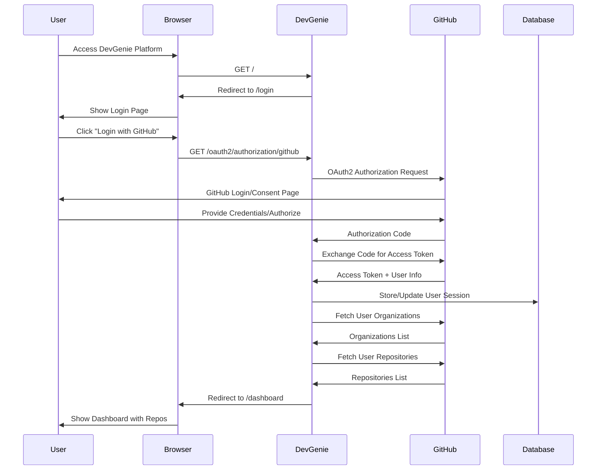
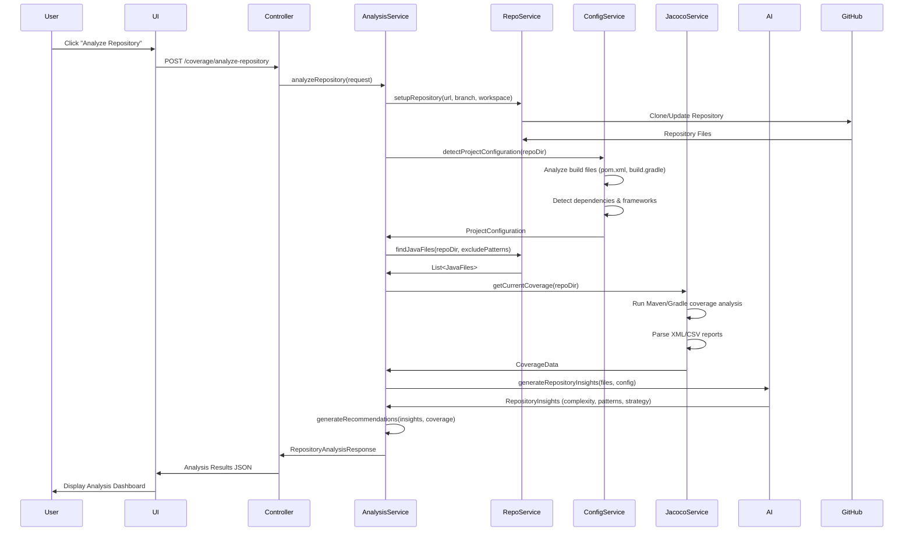
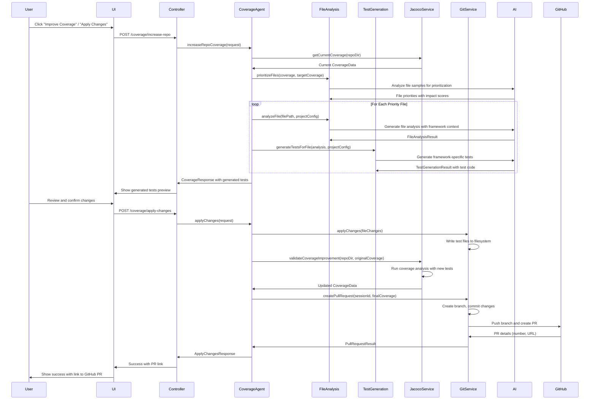

# Executive Summary: DevGenie Coverage Agent

## Problem Statement
Organizations struggle with inadequate test coverage in their Java applications, leading to:

- **Quality Risk:** Low coverage increases the likelihood of production bugs and system failures
- **Technical Debt:** Manual test writing is time-consuming and often incomplete
- **Developer Productivity:** Engineers spend excessive time writing boilerplate tests instead of focusing on business logic
- **Compliance Issues:** Many enterprises require minimum coverage thresholds (70-80%) that are difficult to achieve manually
- **Knowledge Gaps:** Developers may not know what edge cases to test or how to structure comprehensive test suites

Current solutions are fragmented, requiring developers to manually analyze coverage reports, identify gaps, and write tests without intelligent guidance.

---

## Solution Overview
DevGenie Coverage Agent is an AI-powered platform that automatically enhances Java application test coverage through intelligent analysis and automated test generation.

### Core Capabilities
- **Smart Repository Analysis:** Automatically detects project configuration (Maven/Gradle, JUnit 4/5, Spring Boot) and analyzes existing coverage
- **AI-Driven Test Generation:** Uses advanced LLMs to generate comprehensive, contextually-aware unit and integration tests
- **Multi-Build Tool Support:** Native support for Maven, Gradle, and SBT projects with framework-specific optimizations
- **Automated Pull Request Creation:** Seamlessly integrates generated tests via GitHub PRs with detailed coverage reports
- **Enterprise Integration:** Supports GitHub Enterprise, SonarQube, and custom CI/CD pipelines

---

## Unique Selling Points (USP)

### 1. Framework-Intelligent Test Generation
- Unlike generic code generators, our AI understands Spring Boot patterns, dependency injection, and framework-specific testing best practices
- Generates `@MockBean`, `@WebMvcTest`, and `@DataJpaTest` configurations automatically
- Adapts test style based on detected project patterns (service layer, repository pattern, etc.)

### 2. Multi-Strategy Coverage Analysis
- **Primary:** Jacoco integration with auto-configuration
- **Fallback:** SonarQube API integration for enterprise environments
- **Intelligent:** Estimation-based analysis when tools aren't available
- **Validation:** Post-generation coverage verification with multiple measurement approaches

### 3. Zero-Configuration Deployment
- Automatically detects and configures Jacoco for projects that don't have it
- Supports both hosted and on-premise deployments
- Works with existing CI/CD without requiring pipeline modifications

### 4. Enterprise-Grade Security & Compliance
- GitHub OAuth integration with fine-grained permissions
- Supports private repositories and GitHub Enterprise
- Maintains audit trails and compliance reporting
- Respects organizational security policies

### 5. Intelligent Prioritization
- AI-powered file prioritization based on business impact and complexity
- Risk assessment considering code patterns and architectural concerns
- Effort estimation to optimize coverage improvement ROI

---

## Sequence Diagrams
### 1. Login Flow

### 2. Repository Analysis Flow

### 3. Apply Changes Flow

---

## Key Technical Differentiators
- **Smart Configuration Detection:** Automatically adapts to project structure without manual setup
- **Multi-Fallback Strategy:** Ensures coverage analysis works even in complex enterprise environments
- **Context-Aware AI:** Generates tests that understand Spring Boot, dependency injection, and enterprise patterns
- **Seamless Integration:** Works within existing development workflows without disruption
- **Enterprise Scalability:** Supports large codebases with intelligent batching and prioritization

---

This platform transforms test coverage from a manual, time-consuming task into an automated, intelligent process that enhances software quality while accelerating development velocity.