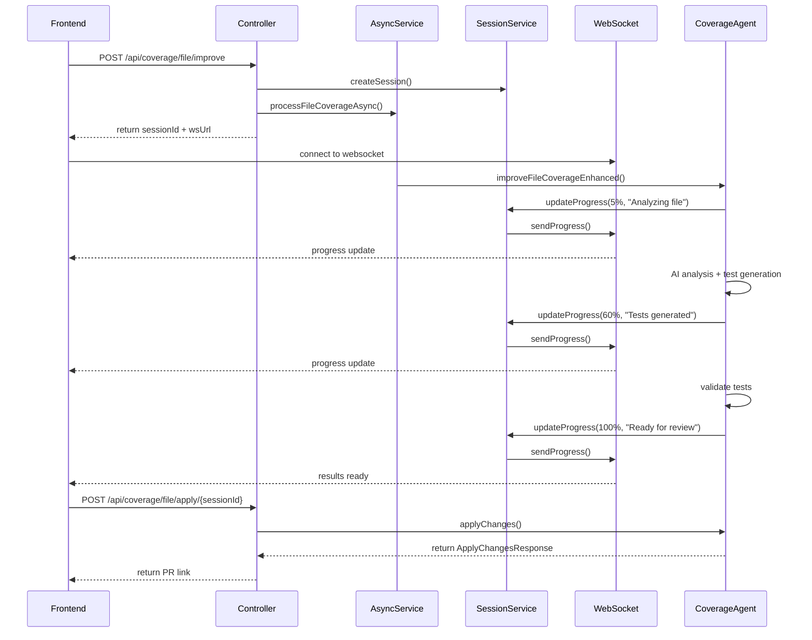
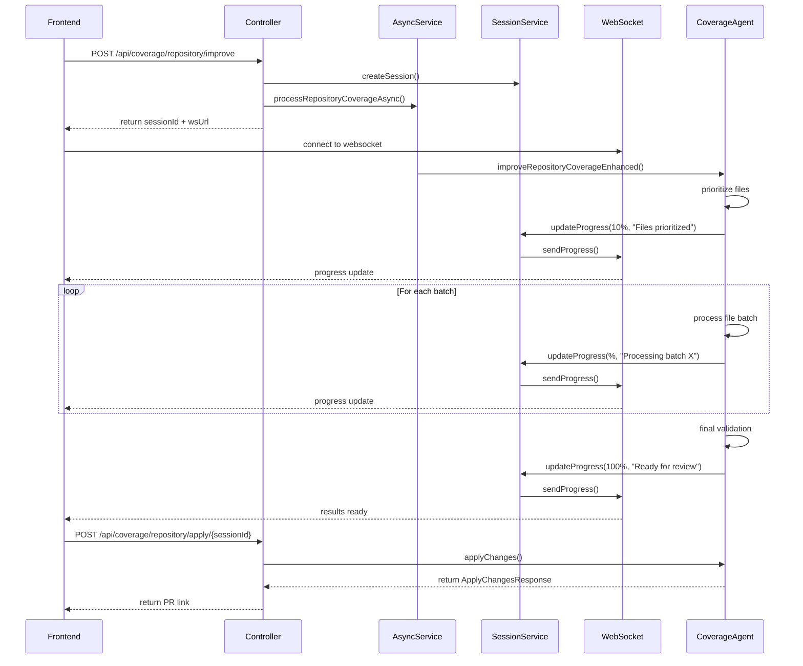

# Coverage Improvement Implementation Plan

## Overview
This document provides a detailed implementation plan for adding file and repository coverage improvement functionality to the DevGenie Coverage Agent. The implementation follows a session-based asynchronous processing model with real-time progress tracking.

## Current State Analysis

### What's Already Implemented ✅
- Repository analysis with metadata extraction
- Project configuration detection (Maven/Gradle/SBT)
- SonarQube integration for coverage data
- MongoDB persistence layer
- Dashboard caching system
- Workspace management with persistent storage
- Basic CoverageAgentService structure

### What Needs Implementation ❌
- TestGenerationService actual implementation
- File prioritization algorithm
- Session management system
- Progress tracking via WebSocket
- Coverage validation enhancement
- Batch processing logic
- Results review and application flow

## Architecture Overview

```
┌─────────────────┐    ┌──────────────────┐    ┌─────────────────┐
│   Frontend UI   │ -> │ Coverage API     │ -> │ Session Manager │
└─────────────────┘    └──────────────────┘    └─────────────────┘
                                │                        │
                                ▼                        ▼
┌─────────────────┐    ┌──────────────────┐    ┌─────────────────┐
│ WebSocket       │ <- │ Async Processor  │ -> │ Test Generator  │
│ Progress        │    │ (Background)     │    │ Service         │
└─────────────────┘    └──────────────────┘    └─────────────────┘
                                │                        │
                                ▼                        ▼
┌─────────────────┐    ┌──────────────────┐    ┌─────────────────┐
│ MongoDB         │ <- │ Coverage         │ -> │ Git Service     │
│ Session Store   │    │ Validator        │    │ (PR Creation)   │
└─────────────────┘    └──────────────────┘    └─────────────────┘
```

## Implementation Phases

### Phase 1: Core Infrastructure Setup

#### 1.1 Session Management System

**Files to Create:**
- `src/main/java/com/org/devgenie/model/coverage/CoverageImprovementSession.java`
- `src/main/java/com/org/devgenie/service/coverage/SessionManagementService.java`
- `src/main/java/com/org/devgenie/mongo/CoverageSessionRepository.java`

**CoverageImprovementSession Model:**
```java
@Document(collection = "coverage_improvement_sessions")
@Data
@Builder
public class CoverageImprovementSession {
    @Id
    private String sessionId;
    private String repositoryUrl;
    private String branch;
    private String filePath; // null for repository-level
    private SessionType type; // FILE_IMPROVEMENT, REPO_IMPROVEMENT
    private SessionStatus status;
    private double progress; // 0-100
    private String currentStep;
    private LocalDateTime startedAt;
    private LocalDateTime estimatedCompletion;
    private Integer processedFiles;
    private Integer totalFiles;
    private List<String> errors;
    private Object results; // JSON field for results
    private Map<String, Object> metadata;
}

enum SessionType { FILE_IMPROVEMENT, REPO_IMPROVEMENT }
enum SessionStatus { 
    CREATED, ANALYZING, PRIORITIZING, GENERATING_TESTS, 
    VALIDATING, READY_FOR_REVIEW, APPLYING_CHANGES, 
    COMPLETED, FAILED, CANCELLED 
}
```

#### 1.2 WebSocket Configuration

**Files to Create:**
- `src/main/java/com/org/devgenie/config/WebSocketConfig.java`
- `src/main/java/com/org/devgenie/websocket/CoverageProgressWebSocketHandler.java`

**WebSocket Handler Implementation:**
```java
@Component
public class CoverageProgressWebSocketHandler extends TextWebSocketHandler {
    private final Map<String, WebSocketSession> sessions = new ConcurrentHashMap<>();
    
    @Override
    public void afterConnectionEstablished(WebSocketSession session) {
        String sessionId = extractSessionId(session.getUri());
        sessions.put(sessionId, session);
    }
    
    public void sendProgress(String sessionId, ProgressUpdate update) {
        WebSocketSession session = sessions.get(sessionId);
        if (session != null && session.isOpen()) {
            session.sendMessage(new TextMessage(toJson(update)));
        }
    }
}
```

#### 1.3 Progress Update DTOs

**Files to Create:**
- `src/main/java/com/org/devgenie/dto/coverage/ProgressUpdate.java`
- `src/main/java/com/org/devgenie/dto/coverage/FileCoverageImprovementResult.java`
- `src/main/java/com/org/devgenie/dto/coverage/RepositoryCoverageImprovementResult.java`

### Phase 2: Test Generation Service Implementation

#### 2.1 Complete TestGenerationService

**Files to Modify:**
- `src/main/java/com/org/devgenie/service/coverage/TestGenerationService.java`

**Required Methods to Implement:**
```java
@Service
public class TestGenerationService {
    
    // For single file improvement
    public TestGenerationResult generateTestsForFile(FileAnalysisResult analysis);
    
    // For repository improvement - batch processing
    public BatchTestGenerationResult generateTestsForBatch(List<FileAnalysisResult> files);
    
    // Validation of generated tests
    public TestValidationResult validateGeneratedTests(String repoDir, List<String> testFiles);
    
    // Framework-specific test patterns
    private String generateJUnit5Test(FileAnalysisResult analysis);
    private String generateSpringBootTest(FileAnalysisResult analysis);
    private String generateMockitoMocks(List<String> dependencies);
}
```

#### 2.2 AI Integration for Test Generation

**Prompts and Templates:**
- Create test generation prompts for different scenarios
- Implement template-based test generation
- Add fallback mechanisms for AI failures

### Phase 3: File Prioritization Algorithm

#### 3.1 Implement File Prioritization

**Files to Modify:**
- `src/main/java/com/org/devgenie/service/coverage/FileAnalysisService.java`

**Prioritization Algorithm:**
```java
public List<FilePriority> prioritizeFiles(List<CoverageData> coverageData, 
                                         List<MetadataAnalyzer.FileMetadata> metadata,
                                         double targetCoverage) {
    
    // Priority calculation based on:
    // 1. Risk score from metadata (weight: 0.3)
    // 2. Coverage gap (100 - current coverage) (weight: 0.25)
    // 3. Business criticality (weight: 0.25)
    // 4. Complexity vs effort ratio (weight: 0.2)
    
    return files.stream()
        .map(this::calculatePriorityScore)
        .sorted(Comparator.comparing(FilePriority::getImpactEffortRatio).reversed())
        .collect(Collectors.toList());
}
```

### Phase 4: Enhanced Coverage Validation

#### 4.1 Improve JacocoService Validation

**Files to Modify:**
- `src/main/java/com/org/devgenie/service/coverage/JacocoService.java`

**New Methods to Add:**
```java
// Enhanced validation with multiple strategies
public CoverageValidationResult validateCoverageImprovementEnhanced(
    String repoDir, String branch, ProjectConfiguration projectConfig,
    CoverageData originalCoverage, List<String> generatedTestFiles);

// Test compilation validation
public CompilationResult validateTestCompilation(String repoDir, List<String> testFiles);

// Test execution validation  
public TestExecutionResult runGeneratedTests(String repoDir, List<String> testFiles);

// Coverage calculation after test generation
public CoverageComparisonResult calculateCoverageImprovement(
    String repoDir, CoverageData before, List<String> newTests);
```

### Phase 5: API Controllers Implementation

#### 5.1 Coverage Improvement Controllers

**Files to Create:**
- `src/main/java/com/org/devgenie/controller/FileCoverageImprovementController.java`
- `src/main/java/com/org/devgenie/controller/RepositoryCoverageImprovementController.java`

**File Coverage Controller:**
```java
@RestController
@RequestMapping("/api/coverage/file")
public class FileCoverageImprovementController {
    
    @PostMapping("/improve")
    public ResponseEntity<SessionResponse> improveFileCoverage(
        @RequestBody FileCoverageImprovementRequest request) {
        
        String sessionId = UUID.randomUUID().toString();
        // Create session and start async processing
        return ResponseEntity.ok(SessionResponse.builder()
            .sessionId(sessionId)
            .websocketUrl("/ws/coverage-progress/" + sessionId)
            .build());
    }
    
    @GetMapping("/status/{sessionId}")
    public ResponseEntity<CoverageImprovementSession> getStatus(@PathVariable String sessionId);
    
    @PostMapping("/apply/{sessionId}")
    public ResponseEntity<ApplyChangesResponse> applyChanges(
        @PathVariable String sessionId,
        @RequestBody ApplyChangesRequest request);
}
```

**Repository Coverage Controller:**
```java
@RestController
@RequestMapping("/api/coverage/repository")
public class RepositoryCoverageImprovementController {
    
    @PostMapping("/improve")
    public ResponseEntity<SessionResponse> improveRepositoryCoverage(
        @RequestBody RepoCoverageImprovementRequest request);
    
    @GetMapping("/status/{sessionId}")
    public ResponseEntity<CoverageImprovementSession> getStatus(@PathVariable String sessionId);
    
    @PostMapping("/apply/{sessionId}")
    public ResponseEntity<ApplyChangesResponse> applyChanges(
        @PathVariable String sessionId,
        @RequestBody ApplyChangesRequest request);
}
```

### Phase 6: Async Processing Service

#### 6.1 Background Processing Service

**Files to Create:**
- `src/main/java/com/org/devgenie/service/coverage/AsyncCoverageImprovementService.java`

**Key Methods:**
```java
@Service
public class AsyncCoverageImprovementService {
    
    @Async("coverageImprovementExecutor")
    public void processFileCoverageImprovement(String sessionId, FileCoverageImprovementRequest request);
    
    @Async("coverageImprovementExecutor")
    public void processRepositoryCoverageImprovement(String sessionId, RepoCoverageImprovementRequest request);
    
    private void updateSessionProgress(String sessionId, double progress, String step);
    private void handleProcessingError(String sessionId, Exception error);
}
```

#### 6.2 Async Configuration

**Files to Create:**
- `src/main/java/com/org/devgenie/config/AsyncConfig.java`

### Phase 7: Enhanced CoverageAgentService Methods

#### 7.1 Implement Core Coverage Improvement Logic

**Files to Modify:**
- `src/main/java/com/org/devgenie/service/coverage/CoverageAgentService.java`

**Methods to Implement:**
```java
// File Coverage Improvement - Complete Implementation
public FileCoverageImprovementResult improveFileCoverageEnhanced(
    String sessionId, FileCoverageImprovementRequest request) {
    
    // Step 1: Setup and analysis (5% progress)
    // Step 2: AI-powered file analysis (15% progress) 
    // Step 3: Test generation (60% progress)
    // Step 4: Validation and compilation (85% progress)
    // Step 5: Results preparation (100% progress)
}

// Repository Coverage Improvement - Complete Implementation  
public RepositoryCoverageImprovementResult improveRepositoryCoverageEnhanced(
    String sessionId, RepoCoverageImprovementRequest request) {
    
    // Step 1: Repository setup and analysis (5% progress)
    // Step 2: File prioritization (10% progress)
    // Step 3: Batch processing loop (10-90% progress)
    // Step 4: Final validation (95% progress)
    // Step 5: Results preparation (100% progress)
}
```

### Phase 8: Frontend Integration Points

#### 8.1 Template Updates Required

**Files to Modify:**
- `src/main/resources/templates/repository-dashboard.html`
- Add progress modal/overlay components
- Add WebSocket connection handling
- Add results review interface

**JavaScript Enhancements Needed:**
```javascript
// WebSocket connection for progress tracking
function connectToProgressWebSocket(sessionId) {
    const ws = new WebSocket(`/ws/coverage-progress/${sessionId}`);
    ws.onmessage = handleProgressUpdate;
}

// Progress modal management
function showCoverageImprovementModal(type, filePath) {
    // Display modal with progress bar
    // Start coverage improvement process
    // Connect to WebSocket for updates
}

// Results review interface
function showImprovementResults(results) {
    // Display generated tests
    // Show coverage improvements
    // Provide apply/reject options
}
```

## Detailed Flow Implementation

### File Coverage Improvement Flow



### Repository Coverage Improvement Flow



## Data Models and DTOs

### Request DTOs
```java
// FileCoverageImprovementRequest
@Data
public class FileCoverageImprovementRequest {
    private String repositoryUrl;
    private String branch;
    private String filePath;
    private Double targetCoverageIncrease; // optional
    private String githubToken; // optional
}

// RepoCoverageImprovementRequest  
@Data
public class RepoCoverageImprovementRequest {
    private String repositoryUrl;
    private String branch;
    private Double targetCoverageIncrease; // e.g., 20.0 for +20%
    private Integer maxFilesToProcess; // e.g., 15
    private String githubToken; // optional
}
```

### Response DTOs
```java
// FileCoverageImprovementResult
@Data
@Builder
public class FileCoverageImprovementResult {
    private String filePath;
    private Double originalCoverage;
    private Double improvedCoverage;
    private Double coverageIncrease;
    private List<GeneratedTest> generatedTests;
    private List<String> testFiles;
    private CoverageBreakdown coverageBreakdown;
    private List<String> recommendations;
}

// RepositoryCoverageImprovementResult
@Data
@Builder
public class RepositoryCoverageImprovementResult {
    private Double originalOverallCoverage;
    private Double improvedOverallCoverage;
    private Double totalCoverageIncrease;
    private Integer filesProcessed;
    private Integer testsGenerated;
    private List<FileImprovementSummary> fileResults;
    private CoverageBreakdown overallBreakdown;
    private List<String> recommendations;
}
```

## Error Handling Strategy

### Error Categories and Responses

1. **Validation Errors (400)**
   - Invalid repository URL
   - File not found
   - Invalid parameters

2. **Processing Errors (500)**
   - AI service timeout
   - Git operations failed
   - Build/compilation errors

3. **Recoverable Errors**
   - Single file processing failure
   - Partial batch completion
   - Network timeouts

### Error Recovery Mechanisms

```java
@Component
public class CoverageImprovementErrorHandler {
    
    public void handleFileProcessingError(String sessionId, String filePath, Exception error) {
        // Log error
        // Update session with error details
        // Continue with next file (for batch processing)
        // Notify user via WebSocket
    }
    
    public void handleBuildError(String sessionId, CompilationError error) {
        // Attempt automatic fixes
        // Provide fix suggestions
        // Allow manual intervention
    }
}
```

## Testing Strategy

### Unit Tests Required
- SessionManagementService tests
- TestGenerationService tests  
- File prioritization algorithm tests
- Coverage validation tests
- WebSocket handler tests

### Integration Tests Required
- End-to-end file improvement flow
- End-to-end repository improvement flow
- Error scenarios testing
- Progress tracking validation

## Configuration Properties

```yaml
# application.yml additions
coverage:
  improvement:
    max-concurrent-sessions: 5
    session-timeout-minutes: 30
    max-files-per-batch: 10
    websocket-enabled: true
  ai:
    test-generation-timeout: 60s
    max-retries: 3
    fallback-enabled: true
```

## Implementation Checklist

### Phase 1: Infrastructure ☐
- [ ] CoverageImprovementSession model
- [ ] SessionManagementService
- [ ] WebSocket configuration
- [ ] Progress update DTOs
- [ ] MongoDB session repository

### Phase 2: Test Generation ☐
- [ ] Complete TestGenerationService implementation
- [ ] AI integration for test generation
- [ ] Framework-specific templates
- [ ] Test validation logic

### Phase 3: File Prioritization ☐
- [ ] Prioritization algorithm implementation
- [ ] Impact score calculation
- [ ] Business criticality integration
- [ ] Performance optimization

### Phase 4: Coverage Validation ☐
- [ ] Enhanced JacocoService methods
- [ ] Multiple validation strategies
- [ ] Test compilation validation
- [ ] Coverage comparison logic

### Phase 5: API Layer ☐
- [ ] File coverage controller
- [ ] Repository coverage controller
- [ ] Request/response DTOs
- [ ] Error handling

### Phase 6: Async Processing ☐
- [ ] AsyncCoverageImprovementService
- [ ] Background task management
- [ ] Progress tracking integration
- [ ] Error recovery mechanisms

### Phase 7: Core Logic ☐
- [ ] Enhanced CoverageAgentService methods
- [ ] Session management integration
- [ ] Batch processing logic
- [ ] Results preparation

### Phase 8: Frontend Integration ☐
- [ ] WebSocket client implementation
- [ ] Progress modal components
- [ ] Results review interface
- [ ] Error handling UI

## Success Criteria

### Functional Requirements ✅
- [ ] File coverage improvement with real-time progress
- [ ] Repository coverage improvement with batch processing
- [ ] Session-based state management
- [ ] WebSocket progress updates
- [ ] Results review and application
- [ ] Git integration with PR creation

### Performance Requirements ✅
- [ ] Handle up to 5 concurrent improvement sessions
- [ ] Process up to 50 files in repository mode
- [ ] Complete file improvement in under 2 minutes
- [ ] Real-time progress updates (< 1 second delay)

### Quality Requirements ✅
- [ ] 90%+ test coverage for new components
- [ ] Comprehensive error handling
- [ ] Graceful degradation for AI failures
- [ ] Session recovery after application restart

This implementation plan provides a complete roadmap for adding coverage improvement functionality to your DevGenie Coverage Agent. Each phase builds upon the previous one, ensuring a solid foundation for the final implementation.