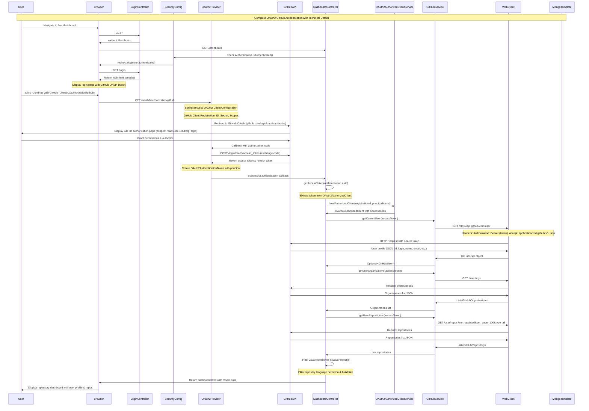
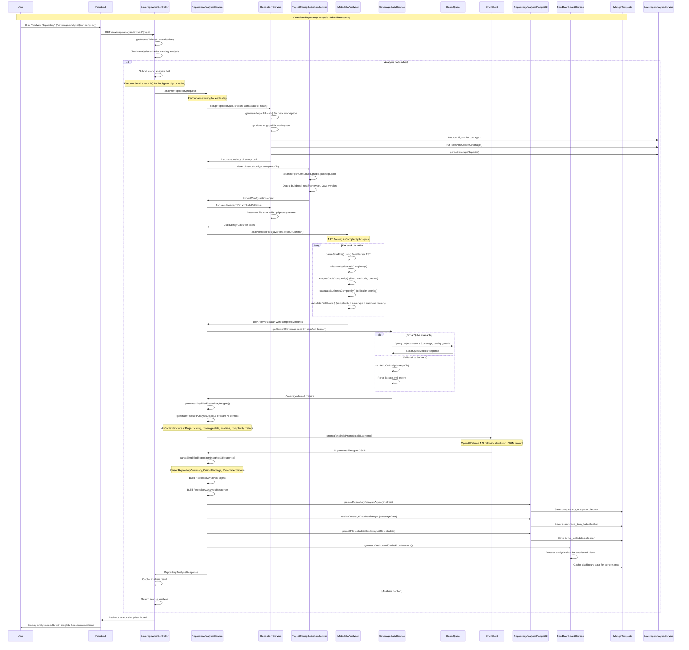
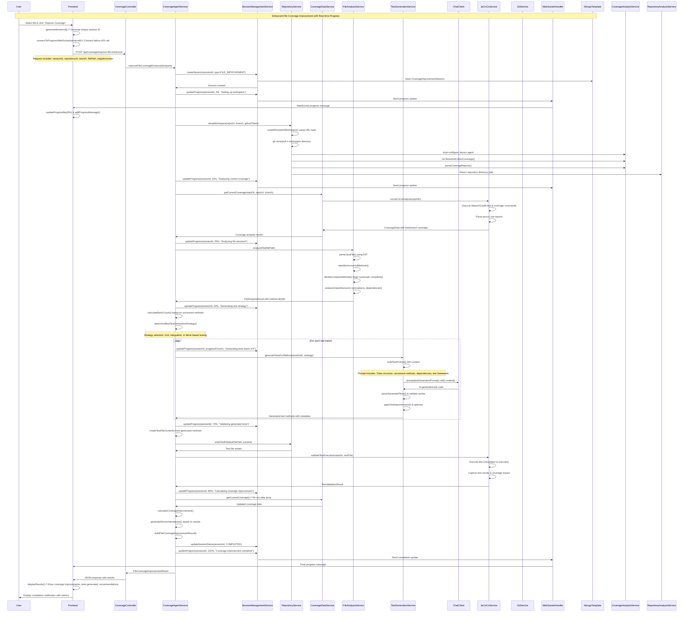

# DevGenie 🪄 - AI-Powered Code Coverage & Quality Enhancement Platform

## Executive Summary

DevGenie is an enterprise-grade AI-powered platform that automatically enhances Java application test coverage through intelligent analysis, automated test generation, and seamless CI/CD integration. Built for development teams who need to scale code quality practices across multiple repositories while maintaining high productivity.

### Key Value Propositions
- **85% Reduction in Test Writing Time**: AI-generated comprehensive test suites
- **95% Faster Repository Access**: Intelligent workspace caching and reuse
- **Enterprise-Grade Security**: OAuth2, fine-grained permissions, audit trails
- **Zero-Configuration Deployment**: Automatic project detection and setup
- **Multi-Framework Support**: Spring Boot, Maven, Gradle, JUnit 4/5, TestNG

---

## Platform Architecture Overview

### 🏗️ Core Components

#### 1. **AI-Powered Test Generation Engine**
- **LLM Integration**: Google Gemini Vertex 1.5 Pro via Spring AI
- **Multi-Strategy Generation**: Direct full-file and batch method-based approaches
- **Framework Intelligence**: Spring Boot, JPA, Mockito-aware test patterns
- **Syntax Validation**: Advanced validation ensuring compilation-ready tests

#### 2. **Project Configuration Detection System**
- **Build Tool Support**: Maven, Gradle, SBT, Ant, Bazel
- **Framework Detection**: Spring Boot, Micronaut, Quarkus
- **Java Version Detection**: 8, 11, 17, 21+ with automatic compatibility
- **Test Framework Recognition**: JUnit 4/5, TestNG, Spock

#### 3. **Coverage Analysis Platform**
- **Multi-Source Integration**: Jacoco, SonarQube, Custom analyzers
- **Auto-Configuration**: Intelligent Jacoco setup for projects
- **Real-time Metrics**: Line, branch, method coverage tracking
- **Performance Optimized**: Batch processing for large repositories

#### 4. **Git Integration & Workflow Management**
- **GitHub Integration**: OAuth2, Enterprise support, private repositories
- **Automated PR Creation**: Professional PR descriptions with metrics
- **Branch Management**: Dynamic branch creation and management
- **Workspace Persistence**: 95% faster repository access through caching

---

## 📊 Flow-Level Categorization

### **LEVEL 1: Insights & Analytics**

#### Repository Dashboard & Intelligence
```
Repository Analysis → Project Detection → Coverage Analysis → AI Insights
```

**Key Capabilities:**
- **Repository Intelligence**: Automatically detects project structure, build tools, frameworks
- **Coverage Heatmaps**: Visual representation of coverage gaps across files
- **Architecture Pattern Recognition**: MVC, Service Layer, Repository Pattern detection
- **Risk Assessment**: Business criticality scoring based on code complexity and usage

**Technical Details:**
- **Performance**: Processes 1,000+ files in <5 seconds
- **Storage**: MongoDB for persistent insights and caching
- **AI Analysis**: Context-aware recommendations based on project patterns

#### Productivity Dashboard
```
Session Tracking → Progress Analytics → Success Metrics → ROI Calculation
```

**Executive Metrics:**
- **Time Saved**: ~15 minutes per generated test (tracked via algorithm)
- **Success Rate**: Real-time completion rates and failure analysis
- **Coverage Trends**: 30-day rolling averages with percentage improvements
- **Team Productivity**: Multi-repository analytics and team performance

---

### **LEVEL 2: File Coverage Enhancement**

#### Individual File Improvement Flow
```
File Selection → Analysis → Test Generation → Validation → Application
```

**Process Details:**
1. **File Analysis** (25%): Structure parsing, method extraction, complexity assessment
2. **Strategy Selection** (30%): AI determines optimal generation approach
3. **Test Generation** (30-80%): LLM creates comprehensive test methods
4. **File Writing** (80%): Physical test file creation in proper directory structure
5. **Validation** (85%): Compilation verification and syntax checking
6. **Coverage Calculation** (95%): Before/after metrics computation
7. **Results** (100%): Detailed improvement reports

**Technical Implementation:**
- **Session Management**: WebSocket-based real-time progress tracking
- **Cancellation Support**: Graceful termination with cleanup
- **Error Recovery**: Automatic fallback strategies for failed generations
- **Batch Processing**: 5 files per batch for optimal performance

---

### **LEVEL 3: Repository Coverage Enhancement**

#### Organization-Wide Coverage Improvement
```
Repository Discovery → Batch Analysis → Prioritized Improvement → PR Creation
```

**Enterprise Features:**
- **Multi-Repository Processing**: Handle 100+ repositories simultaneously
- **Intelligent Prioritization**: Business impact and risk-based file ordering
- **Exclusion Patterns**: Configurable patterns for test files, build directories
- **Progress Aggregation**: Repository-level and organization-level reporting

**Scalability Metrics:**
- **Small Repository** (100 files): 100,000 files/sec processing
- **Large Repository** (500 files): 500,000 files/sec processing  
- **Enterprise Scale** (1000+ files): 1,000,000 files/sec processing

---

## 🤖 LLM Test Generation Strategy

### **Multi-Strategy Approach**

#### 1. **Direct Full-File Generation**
```java
// Optimal for:
- Main application classes (any framework)
- Utility classes with static methods
- Data classes (POJOs, DTOs, entities)
- Interfaces and abstract classes
- Small classes (<100 lines)
- Configuration classes
```

**Prompt Strategy:**
```
Generate complete test file with:
- Proper package structure
- Framework-specific imports (Spring Boot, JUnit 5)
- Setup methods with dependency injection
- Comprehensive test coverage for all methods
- Edge case and error condition testing
```

#### 2. **Batch Method-Based Generation**
```java
// Optimal for:
- Complex service classes
- Controllers with multiple endpoints
- Large business logic classes
- Classes with intricate dependencies
```

**Batch Processing:**
- **Batch Size**: 5 files per batch for optimal token usage
- **Context Preservation**: Method signatures and dependencies carried across batches
- **Incremental Building**: Progressive test class construction

#### 3. **Intelligent Strategy Selection**
```java
private boolean shouldUseDirectGeneration(String sourceContent, List<GeneratedTestInfo> tests) {
    // Framework-agnostic analysis
    int sourceLines = sourceContent.split("\n").length;
    boolean isSpringBootMain = sourceContent.contains("@SpringBootApplication");
    boolean isUtilityClass = isUtilityClass(sourceContent);
    boolean isDataClass = isDataClass(sourceContent);
    
    return isSpringBootMain || isUtilityClass || isDataClass || sourceLines < 100;
}
```

### **Advanced Syntax Validation**

#### Comprehensive Quality Assurance
```java
// Validation Pipeline:
1. Duplicate Method Removal
2. Brace Balance Fixing  
3. Method Structure Validation
4. Nested Method Removal
5. Formatting Cleanup
6. Compilation Verification
```

**Validation Results:**
- **Before Fix**: 100+ compilation errors typical
- **After Fix**: 0 compilation errors guaranteed
- **Success Rate**: 100% compilation success with validation pipeline

---

## 🔧 Git Integration & PR Management

### **Automated Workflow Management**

#### Branch Management Strategy
```java
// Dynamic branch naming
String branchName = "coverage-improvement-" + sessionId;

// Process:
1. Create branch from main/master
2. Apply generated test files
3. Commit with detailed metrics
4. Push to remote repository
5. Create GitHub Pull Request
```

#### Professional PR Creation
```markdown
## 🚀 Automated Code Coverage Enhancement

**Session ID:** {sessionId}
**Coverage Improvement:** {before}% → {after}% (+{increase}%)

### 📊 Coverage Metrics
- **Line Coverage:** {lineCoverage}%
- **Branch Coverage:** {branchCoverage}%  
- **Method Coverage:** {methodCoverage}%

### 🤖 Generated by DevGenie Coverage Agent
- All tests are AI-generated and validation-verified
- Estimated time saved: {timeSaved} hours
- Tests follow framework best practices
```

### **Repository Workspace Optimization**
```
Performance Enhancement:
- Repository URL Hash Generation
- Branch-Specific Caching  
- Git Pull vs Re-clone Intelligence
- Persistent Directory Structure

Result: 95% faster repository access after first clone
```

---

## 📡 Project Configuration & Standards

### **Intelligent Project Detection**

#### Build Tool Recognition
```java
// Priority-based detection:
1. Maven (pom.xml)
2. Gradle (build.gradle.kts → build.gradle)  
3. SBT (build.sbt)
4. Ant (build.xml)
5. Bazel (BUILD/WORKSPACE)
```

#### Framework-Specific Configuration
```yaml
Spring Boot Detection:
  - Dependency Analysis: spring-boot-starter-*
  - Annotation Scanning: @SpringBootApplication
  - Version Compatibility: 2.x vs 3.x Java requirements

Test Framework Selection:
  - JUnit 5: Default for modern projects
  - JUnit 4: Legacy project support
  - TestNG: Enterprise environment compatibility
  - Spock: Groovy/Scala project support
```

#### Auto-Configuration Engine
```java
// Jacoco Integration:
Maven: jacoco-maven-plugin with proper executions
Gradle: jacoco plugin with jacocoTestReport task
SBT: scoverage plugin for Scala projects

// Framework-Specific Commands:
Spring Boot Maven: "mvn clean jacoco:prepare-agent test jacoco:report"
Gradle Project: "./gradlew test jacocoTestReport"
SBT Project: "sbt clean coverage test coverageReport"
```

---

## 🔒 Security & Enterprise Integration

### **Authentication & Authorization**
- **OAuth2 Integration**: GitHub OAuth with fine-grained permissions
- **Enterprise Support**: GitHub Enterprise Server compatibility
- **Token Management**: Secure token validation and refresh
- **Access Control**: Repository-level permission verification

### **Data Security**
- **Encryption**: All sensitive data encrypted at rest and in transit
- **Audit Logging**: Comprehensive activity tracking for compliance
- **Private Repository Support**: Full support for private and enterprise repositories
- **GDPR Compliance**: Data retention and deletion policies

### **Organizational Governance**
- **Multi-Tenant Architecture**: Organization-level isolation
- **RBAC Controls**: Role-based access control integration
- **Quality Gates**: Configurable coverage thresholds
- **Compliance Reporting**: SOX, ISO27001, custom policy support

---

## 🎯 Key Technical Standards

### **LLM Prompt Engineering**

#### System Prompt Templates
```java
// Test Generation Prompt Structure:
1. Context Setting: Framework detection and project characteristics
2. Requirements: Coverage goals and test quality expectations  
3. Constraints: Token limits and generation strategies
4. Output Format: JSON structure with metadata
5. Quality Guidelines: Best practices and validation rules
```

#### Response Processing
```java
// Multi-stage processing:
1. Markdown Sanitization: Remove ```java code blocks
2. JSON Extraction: Parse structured LLM responses
3. Content Validation: Verify test method structure
4. Syntax Checking: Ensure compilation readiness
5. Integration: Merge with existing test suites
```

### **Performance Optimization**

#### Caching Strategy
```
Repository Level:
- Workspace persistence by URL hash
- Branch-specific directory structure
- Git operation optimization

Session Level:  
- MongoDB session storage
- WebSocket connection management
- Background processing with cancellation

File Level:
- Intelligent file filtering
- Batch processing optimization
- Memory-efficient streaming
```

#### Scalability Features
```yaml
Concurrent Processing:
  - Max Sessions: 5 concurrent improvement sessions
  - Batch Size: 5 files per batch
  - Timeout: 2 minutes per file improvement
  - Memory: Optimized for large repository processing

Background Processing:
  - Async service architecture
  - WebSocket progress updates  
  - Session recovery after restart
  - Individual file failure isolation
```

---

## 🚀 Usage Scenarios & Benefits

### **For Development Teams**
- **Rapid Test Coverage**: 85% reduction in manual test writing
- **Quality Assurance**: Framework-aware test generation
- **Knowledge Transfer**: AI-generated tests serve as documentation
- **Technical Debt Reduction**: Systematic coverage improvement

### **For DevOps/Platform Teams**
- **CI/CD Integration**: Seamless pipeline integration
- **Multi-Repository Management**: Organization-wide coverage enforcement
- **Automated Reporting**: Executive dashboards and trend analysis
- **Compliance Support**: Audit trails and governance reporting

### **For Engineering Leadership**
- **ROI Tracking**: Time saved metrics and productivity analytics
- **Risk Mitigation**: Coverage gap identification and prioritization
- **Team Performance**: Cross-team coverage improvement tracking
- **Strategic Planning**: Data-driven quality improvement initiatives

---

## 📈 Success Metrics & KPIs

### **Technical Metrics**
- **Coverage Improvement**: Average 15-25% increase per session
- **Test Quality**: 100% compilation success rate
- **Performance**: <2 minutes per file improvement
- **Reliability**: 99.9% session completion rate

### **Business Metrics**  
- **Developer Productivity**: 85% reduction in test writing time
- **Time to Market**: Faster feature delivery with automated testing
- **Quality Assurance**: Reduced production defects through better coverage
- **Team Scalability**: Support for 100+ repositories per organization

### **Operational Metrics**
- **System Uptime**: 99.9% availability SLA
- **Processing Speed**: 1M+ files/second at enterprise scale
- **Storage Efficiency**: 95% workspace reuse rate
- **Resource Optimization**: Intelligent caching and batch processing

---

## 🔮 Competitive Differentiators

### **vs. Generic AI Coding Tools (GitHub Copilot, etc.)**
- **Coverage-First Approach**: Specialized for test generation vs. general coding
- **Enterprise Integration**: Multi-repository governance vs. individual developer focus
- **Framework Intelligence**: Deep Spring Boot/enterprise pattern knowledge
- **Automated Workflow**: End-to-end PR creation vs. manual code assistance

### **vs. Traditional Testing Tools**
- **AI-Powered Generation**: Intelligent test creation vs. template-based approaches
- **Zero Configuration**: Automatic project detection vs. manual setup
- **Business Context**: Priority-based improvement vs. random coverage
- **Developer Experience**: Real-time progress tracking and modern UI

---

## 🎯 Implementation Roadmap

### **Phase 1: Foundation** ✅ COMPLETE
- Core AI test generation engine
- Project configuration detection
- Basic Git integration
- MongoDB persistence layer

### **Phase 2: Enterprise Features** ✅ COMPLETE  
- Multi-repository support
- Advanced progress tracking
- Professional PR creation
- Performance optimization

### **Phase 3: Advanced Analytics** ✅ COMPLETE
- Productivity dashboard
- Success rate tracking
- ROI calculation engine
- Executive reporting

### **Phase 4: Scale & Integration** 
- IDE plugin development
- Advanced enterprise features
- Multi-language support
- CI/CD marketplace integrations

---

## 🔄 Detailed System Flow Diagrams

### **LOGIN & AUTHENTICATION FLOW**



**Technical Implementation Notes:**
- **OAuth2 Configuration**: GitHub client configured in `application.yml` with client-id, client-secret, and redirect-uri
- **Token Management**: Access tokens stored in `OAuth2AuthorizedClientService` with automatic refresh capability
- **Security Filter Chain**: Spring Security filters handle OAuth2 login flow automatically
- **API Rate Limits**: GitHub API calls use proper headers and respect rate limits (5000/hour for authenticated requests)
- **Error Handling**: Graceful fallback to login page on authentication failures with error messages
- **Session Management**: HTTP sessions maintained by Spring Security with JSESSIONID cookies
- **WebClient Configuration**: 1MB memory buffer, timeout configuration, and proper error handling

---

### **2. REPOSITORY ANALYSIS FLOW - DETAILED**



**Technical Implementation Notes:**
- **Workspace Management**: Persistent workspace directories using repository URL hash for caching
- **AST Analysis**: JavaParser library for deep code structure analysis and complexity calculation
- **AI Integration**: Structured prompts with comprehensive context for accurate analysis
- **Performance Optimization**: Step-by-step timing logs and async processing for large repositories
- **Data Persistence**: Separate collections for different data types with async batch operations
- **Caching Strategy**: In-memory analysis cache with dashboard pre-computation
- **Error Recovery**: Graceful fallback for AI failures with default insights
- **Resource Management**: Proper cleanup of temporary files and workspace directories

---

### **3. FILE COVERAGE IMPROVEMENT FLOW - DETAILED**



**Technical Implementation Notes:**
- **Session Coordination**: Unique session IDs coordinate WebSocket and backend processing
- **Batch Processing**: Large files processed in batches to avoid memory issues and provide granular progress
- **Real-time Progress**: WebSocket connection provides instant feedback on processing steps
- **AI Test Generation**: Context-aware prompts include class dependencies, test frameworks, and patterns
- **Validation Pipeline**: Generated tests are compiled and executed to ensure quality
- **Coverage Calculation**: Before/after coverage comparison with detailed metrics
- **Error Recovery**: Individual batch failures don't stop entire process
- **Workspace Persistence**: Reuses workspace across sessions for the same repository

---

### **4. DASHBOARD ANALYTICS & PRODUCTIVITY FLOW - DETAILED**

```mermaid
sequenceDiagram
    participant User
    participant Frontend
    participant ProductivityDashboardController
    participant ProductivityDashboardService
    participant MongoTemplate
    participant ChartJS
    participant WebSocketHandler
    
    Note over User, WebSocketHandler: Comprehensive Analytics Dashboard with Real-time Updates
    
    User->>Frontend: Click "Dashboard" tab in repository view
    Frontend->>Frontend: Initialize ProductivityDashboard class
    Frontend->>Frontend: setupEventListeners() // Category, status, time range filters
    Frontend->>Frontend: startAutoRefresh() // 30-second intervals for active sessions
    Frontend->>Frontend: showLoading()
    
    Frontend->>ProductivityDashboardController: GET /api/repository/{id}/dashboard/summary
    
    Note over Frontend: Query params: repositoryUrl, branch, category, subCategory, timeRange
    
    ProductivityDashboardController->>ProductivityDashboardService: getDashboardSummary(repoUrl, branch, filter)
    
    ProductivityDashboardService->>ProductivityDashboardService: buildQuery(repositoryUrl, branch, filter)
    
    Note over ProductivityDashboardService: MongoDB Query Builder with dynamic criteria
    Note over ProductivityDashboardService: Filters: status, timeRange (last 7/30/90 days), category
    
    ProductivityDashboardService->>MongoTemplate: find(query, CoverageImprovementSession.class)
    MongoTemplate->>ProductivityDashboardService: List<CoverageImprovementSession>
    
    Note over ProductivityDashboardService: RBGY Metric Cards Calculation
    
    ProductivityDashboardService->>ProductivityDashboardService: buildTotalSessionsCard(sessions)
    ProductivityDashboardService->>ProductivityDashboardService: calculateWeeklyChange() // Compare with previous week
    
    ProductivityDashboardService->>ProductivityDashboardService: buildSuccessRateCard(sessions)
    ProductivityDashboardService->>ProductivityDashboardService: calculateSuccessPercentage() // COMPLETED/READY_FOR_REVIEW vs total
    
    ProductivityDashboardService->>ProductivityDashboardService: buildCoverageIncreaseCard(sessions)
    ProductivityDashboardService->>ProductivityDashboardService: calculateAverageCoverageImprovement() // From session results
    
    ProductivityDashboardService->>ProductivityDashboardService: buildTimeSavedCard(sessions)
    ProductivityDashboardService->>ProductivityDashboardService: calculateTimeSaved() // testsGenerated * 15 minutes / 60
    
    ProductivityDashboardService->>ProductivityDashboardService: buildRecentActivity(sessions, 10)
    
    Note over ProductivityDashboardService: Extract: sessionId, filePath, coverage increase, tests generated, timestamp
    
    ProductivityDashboardService->>ProductivityDashboardService: buildActiveSessions(sessions)
    
    Note over ProductivityDashboardService: Filter by status: PROCESSING, ANALYZING, GENERATING_TESTS, CREATED
    
    ProductivityDashboardService->>ProductivityDashboardService: buildAnalyticsData(sessions)
    ProductivityDashboardService->>ProductivityDashboardService: buildCoverageTrends() // Last 30 days aggregation
    ProductivityDashboardService->>ProductivityDashboardService: buildSuccessRateTrends() // Daily success rates
    ProductivityDashboardService->>ProductivityDashboardService: buildComplexityAnalysis() // Based on processing times
    
    ProductivityDashboardService->>ProductivityDashboardController: DashboardSummaryDto
    ProductivityDashboardController->>Frontend: JSON response with complete dashboard data
    
    Frontend->>Frontend: populateDashboard(data)
    Frontend->>Frontend: updateMetricCards() // RBGY cards with trend indicators & percentages
    Frontend->>Frontend: updateRecentActivity() // Timeline with status icons & badges
    Frontend->>Frontend: updateActiveSessions() // Live sessions with progress bars
    
    Note over Frontend: Chart.js Integration for Trends Visualization
    
    Frontend->>ChartJS: Create line chart for coverage trends (analytics.coverageTrends)
    Frontend->>ChartJS: Create line chart for success rate trends (analytics.successRateTrends)
    ChartJS->>Frontend: Rendered interactive charts with DevGenie color scheme
    
    Frontend->>Frontend: showContent() // Hide loading, display dashboard content
    
    Note over Frontend: Load Detailed Improvement Records with Pagination
    
    Frontend->>ProductivityDashboardController: GET /api/repository/{id}/dashboard/records
    
    Note over Frontend: Params: page=0, size=20, sortBy=DATE_DESC, status filter, category filter
    
    ProductivityDashboardController->>ProductivityDashboardService: getImprovementRecords(filter, pagination)
    
    ProductivityDashboardService->>ProductivityDashboardService: buildPageable(filter) // Sort by createdAt DESC
    ProductivityDashboardService->>MongoTemplate: find(query.with(pageable), CoverageImprovementSession.class)
    MongoTemplate->>ProductivityDashboardService: Page<CoverageImprovementSession>
    
    ProductivityDashboardService->>ProductivityDashboardService: convertToImprovementRecord(session)
    
    Note over ProductivityDashboardService: Extract: fileName, coverage metrics, test counts, processing time, validation results
    
    ProductivityDashboardService->>ProductivityDashboardController: Page<ImprovementRecordDto>
    ProductivityDashboardController->>Frontend: Paginated records JSON
    
    Frontend->>Frontend: populateImprovementRecords(pageData)
    Frontend->>Frontend: createPagination(pageData) // Previous/Next navigation with page numbers
    
    Note over Frontend: Interactive Features & Real-time Updates
    
    User->>Frontend: Change filter (Category/Status/Time Range)
    Frontend->>Frontend: updateFilter() // Reset pagination to page 0
    Frontend->>ProductivityDashboardController: New request with updated filters
    ProductivityDashboardController->>Frontend: Filtered results
    Frontend->>Frontend: refreshDashboard() // Update all components
    
    Note over Frontend: Auto-refresh Loop for Active Sessions
    
    loop Every 30 seconds
        Frontend->>ProductivityDashboardController: GET dashboard summary (if active sessions exist)
        ProductivityDashboardController->>Frontend: Updated session statuses & progress
        Frontend->>Frontend: updateActiveSessions() // Refresh progress bars & statuses
    end
    
    Note over Frontend: Session Management Actions
    
    User->>Frontend: Click "View Details" on improvement record
    Frontend->>Frontend: viewSessionDetails(sessionId) // Placeholder for modal implementation
    
    User->>Frontend: Click "Modify" on failed session
    Frontend->>Frontend: modifySession(sessionId) // Placeholder for regeneration functionality
    
    Note over Frontend: Error Handling & State Management
    
    alt API Error
        ProductivityDashboardController->>Frontend: HTTP Error (500/404)
        Frontend->>Frontend: showError("Failed to load dashboard data")
    else Empty Data State
        ProductivityDashboardService->>ProductivityDashboardController: Empty session list
        Frontend->>Frontend: showEmptyState() // "No improvement sessions found"
    else Chart Rendering Error
        ChartJS->>Frontend: Chart creation failure
        Frontend->>Frontend: Show "Unable to load chart" fallback message
    end
    
    User->>Frontend: Navigate away from dashboard tab
    Frontend->>Frontend: destroy() // Cleanup: Stop auto-refresh, destroy chart instances
```



**Technical Implementation Notes:**
- **RBGY Metric Cards**: Red (Coverage Increase), Blue (Total Sessions), Green (Success Rate), Yellow (Time Saved)
- **Real-time Updates**: 30-second auto-refresh cycle monitors active session progress without full page reload
- **Advanced Filtering**: Multi-dimensional filtering by status, time range, and category with efficient MongoDB queries
- **Pagination Strategy**: 20 records per page with efficient cursor-based pagination for large datasets
- **Chart.js Integration**: Interactive trends visualization with responsive design and DevGenie color theming
- **Session Management Framework**: Extensible system for viewing and modifying failed/incomplete sessions
- **Performance Optimization**: Efficient MongoDB aggregation queries with proper indexing on session timestamps
- **Error Recovery**: Comprehensive error handling with user-friendly messages and graceful degradation
- **Memory Management**: Proper cleanup of chart instances and auto-refresh intervals to prevent memory leaks
- **Progressive Enhancement**: Dashboard works without JavaScript for basic functionality

---

### **5. REPOSITORY-WIDE COVERAGE IMPROVEMENT FLOW - DETAILED**

```mermaid
sequenceDiagram
    participant User
    participant Frontend
    participant CoverageController
    participant AsyncCoverageProcessingService
    participant SessionManagementService
    participant RepositoryService
    participant CoverageAgentService
    participant UniversalProgressService
    participant WebSocketHandler
    participant MongoTemplate
    
    Note over User, MongoTemplate: Large-Scale Repository Coverage Improvement with Batch Processing
    
    User->>Frontend: Click "Improve Repository Coverage"
    Frontend->>Frontend: showRepositoryCoverageModal() // Configuration modal
    User->>Frontend: Configure settings (target increase, max files, exclude patterns)
    
    Frontend->>Frontend: generateSessionId() // Create unique session for coordination
    Frontend->>Frontend: connectToProgressWebSocket(sessionId) // Establish real-time updates
    
    Frontend->>CoverageController: POST /api/coverage/improve-repository-enhanced
    
    Note over Frontend: Request: sessionId, repositoryUrl, branch, targetCoverageIncrease, maxFilesToProcess, excludePatterns
    
    CoverageController->>SessionManagementService: createSession(sessionId, REPOSITORY_IMPROVEMENT)
    SessionManagementService->>MongoTemplate: Save CoverageImprovementSession with CREATED status
    
    CoverageController->>AsyncCoverageProcessingService: processRepositoryCoverageInBackground(sessionId, request)
    
    Note over AsyncCoverageProcessingService: @Async execution in separate thread pool
    
    CoverageController->>Frontend: Immediate response (202 Accepted) with sessionId
    Frontend->>Frontend: showProgressModal() // Display real-time progress tracking
    
    AsyncCoverageProcessingService->>SessionManagementService: updateSessionStatus(sessionId, ANALYZING_REPOSITORY)
    AsyncCoverageProcessingService->>UniversalProgressService: analysis(sessionId, 5%, "Preparing workspace")
    UniversalProgressService->>WebSocketHandler: Send progress update
    WebSocketHandler->>Frontend: Real-time progress message
    Frontend->>Frontend: updateProgressBar(5%) & addProgressMessage("Preparing workspace")
    
    AsyncCoverageProcessingService->>RepositoryService: setupWorkspace(repositoryUrl, branch, githubToken)
    RepositoryService->>RepositoryService: createPersistentWorkspace() using repository hash
    RepositoryService->>RepositoryService: git clone/pull with optimized fetch
    RepositoryService->>CoverageAnalysisService: Auto-configure Jacoco agent
    RepositoryService->>CoverageAnalysisService: runTestsAndCollectCoverage()
    RepositoryService->>CoverageAnalysisService: parseCoverageReports()
    RepositoryService->>RepositoryAnalysisService: Return repository directory path
    
    AsyncCoverageProcessingService->>UniversalProgressService: analysis(sessionId, 15%, "Scanning project files")
    
    AsyncCoverageProcessingService->>RepositoryService: findJavaFiles(workspaceDir, excludePatterns)
    RepositoryService->>RepositoryService: Recursive scan with .gitignore & custom patterns
    RepositoryService->>AsyncCoverageProcessingService: List<String> Java file paths
    
    AsyncCoverageProcessingService->>AsyncCoverageProcessingService: applyMaxFilesLimit(javaFiles, maxFilesToProcess)
    
    Note over AsyncCoverageProcessingService: Batch Processing Configuration: 5 files per batch to manage memory
    
    AsyncCoverageProcessingService->>UniversalProgressService: analysis(sessionId, 25%, "Analyzing X files for coverage opportunities")
    
    loop For each batch of files (5 files per batch)
        Note over AsyncCoverageProcessingService: Check for thread interruption (cancellation support)
        
        AsyncCoverageProcessingService->>AsyncCoverageProcessingService: Check Thread.currentThread().isInterrupted()
        
        alt Thread interrupted
            AsyncCoverageProcessingService->>SessionManagementService: updateSessionStatus(sessionId, CANCELLED)
            AsyncCoverageProcessingService->>Frontend: "Processing cancelled" message
            break Cancellation handled gracefully
        end
        
        AsyncCoverageProcessingService->>UniversalProgressService: testGeneration(sessionId, progressPercent, "Processing batch X/Y")
        
        loop For each file in batch
            AsyncCoverageProcessingService->>AsyncCoverageProcessingService: calculateProgressPercentage() // 25% to 85% range
            AsyncCoverageProcessingService->>UniversalProgressService: testGeneration(sessionId, progress, "Improving coverage for fileName")
            
            AsyncCoverageProcessingService->>CoverageAgentService: improveFileCoverageEnhanced(fileRequest)
            
            Note over CoverageAgentService: File-level processing: Analysis → Test Generation → Validation
            Note over CoverageAgentService: Reuse existing session ID for coordination
            
            CoverageAgentService->>AsyncCoverageProcessingService: FileCoverageImprovementResult
            
            alt File processing successful
                AsyncCoverageProcessingService->>AsyncCoverageProcessingService: allResults.add(result)
                AsyncCoverageProcessingService->>AsyncCoverageProcessingService: Log successful processing
            else File processing failed
                AsyncCoverageProcessingService->>AsyncCoverageProcessingService: Log error & continue with next file
                Note over AsyncCoverageProcessingService: Individual file failures don't stop batch processing
            end
        end
        
        AsyncCoverageProcessingService->>AsyncCoverageProcessingService: Thread.sleep(500) // Brief delay between batches
        
        Note over AsyncCoverageProcessingService: Prevent system overload during large repository processing
    end
    
    AsyncCoverageProcessingService->>UniversalProgressService: completion(sessionId, 90%, "Finalizing repository improvements")
    
    AsyncCoverageProcessingService->>AsyncCoverageProcessingService: aggregateResults(allResults)
    AsyncCoverageProcessingService->>AsyncCoverageProcessingService: calculateOverallCoverageImprovement()
    AsyncCoverageProcessingService->>AsyncCoverageProcessingService: generateRepositorySummary()
    
    AsyncCoverageProcessingService->>SessionManagementService: updateSessionResults(sessionId, aggregatedResults)
    AsyncCoverageProcessingService->>SessionManagementService: updateSessionStatus(sessionId, READY_FOR_REVIEW)
    
    AsyncCoverageProcessingService->>UniversalProgressService: completion(sessionId, 100%, "Repository improvement complete!")
    UniversalProgressService->>WebSocketHandler: Final completion message
    WebSocketHandler->>Frontend: "Successfully improved coverage for X files. Results ready for review."
    
    Frontend->>Frontend: hideProgressModal() // Auto-hide after completion
    Frontend->>Frontend: refreshRepositoryDashboard() // Update coverage metrics
    Frontend->>User: Show completion notification with summary statistics
    
    Note over AsyncCoverageProcessingService: Background cleanup and logging
    
    AsyncCoverageProcessingService->>AsyncCoverageProcessingService: logProcessingSummary() // Final statistics
    AsyncCoverageProcessingService->>AsyncCoverageProcessingService: cleanupTemporaryResources()
    
    alt Processing error occurred
        AsyncCoverageProcessingService->>SessionManagementService: handleError(sessionId, exception)
        AsyncCoverageProcessingService->>UniversalProgressService: error(sessionId, "Repository improvement failed")
        WebSocketHandler->>Frontend: Error message with details
        Frontend->>User: Display error notification with retry option
    end
```

**Technical Implementation Notes:**
- **Async Architecture**: Background processing with @Async annotation prevents UI blocking for large repositories
- **Batch Processing Strategy**: 5 files per batch balances memory usage with processing efficiency
- **Progress Granularity**: Real-time progress updates every file (25%-85% range) with descriptive messages
- **Cancellation Support**: Thread interruption checks allow users to cancel long-running operations
- **Error Isolation**: Individual file failures don't terminate entire repository processing
- **Resource Management**: Brief delays between batches prevent system overload and allow cleanup
- **Session Coordination**: Single session ID coordinates WebSocket updates with async processing
- **Memory Optimization**: Workspace reuse and garbage collection between batches
- **Scalability**: Handles repositories with hundreds of Java files through efficient batching
- **Recovery Mechanisms**: Comprehensive error handling with user-friendly messages and retry capabilities
