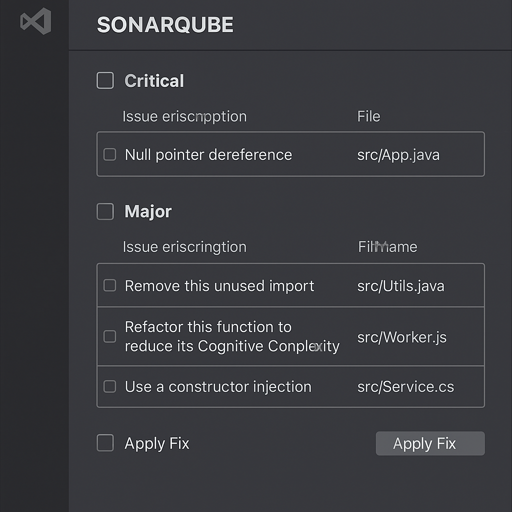

# 🧠 VS Code Plugin for Sonar Issue Fixing via Copilot

## ✅ Objective

Build a **VS Code Plugin** that:
- Shows SonarLint issues grouped by severity
- Allows users to fix individual or multiple issues using Copilot models
- Automatically applies code fixes directly in the source files
- Enhances developer productivity inside their IDE

---

## 🧩 Feature-by-Feature Requirements

### 🔹 1. Plugin UI: Sidebar View

- **Sidebar Title**: `SONARQUBE`
- **Grouped by Severity**:
    - `Blocker`, `Critical`, `Major`, `Minor`, `Info`
    - Each severity group is collapsible
- **Table inside each group**:
    - `Checkbox` – Select one or more issues
    - `Issue Description`
    - `File Name`
    - `Apply Fix` button per row
- **Bulk Fix**:
    - Apply Fix button at the bottom of each group
    - Fixes all selected issues in that group
  

---

### 🔹 2. SonarLint Integration

- **Triggered on Plugin Activation or Refresh**
- **Retrieve Issue Data**:
    - Severity
    - File Path
    - Issue Message
    - Line/Column (optional)
- **Tech**:
    - Use SonarLint CLI/API or integrate with VS Code's existing SonarLint extension

---

### 🔹 3. Copilot (LLM) Integration

- **System Prompt Example**:
- - **Fix Workflow**:
1. Collect file content and issue description
2. Send structured prompt to Copilot model
3. Receive modified code
4. Replace original code with fixed version

---

### 🔹 4. Issue Selection + Bulk Fix Logic

#### 🛠 Single Issue Fix
- Click on `Apply Fix` beside a row
- Send request to LLM
- Replace the code after receiving fixed version

#### 🔄 Bulk Fix
- Select multiple issues using checkboxes
- Click `Apply Fix` at the bottom
- Fixes executed sequentially or in parallel (based on rate limits)
- Shows fix result per issue

---

### 🔹 5. Plugin Configuration

- **Sidebar Activation**: On start or command palette
- **Prompt Configuration**:
- Editable via settings or UI field
- **LLM Token/Settings**:
- Copilot token configuration (optional)
- **Supported File Types**:
- Java, TypeScript, etc. (configurable)

---

### 🔹 6. Error Handling & UX

- **Failures**:
- Show error toast/snackbar
- Allow retry
- **Success**:
- Show success confirmation
- Optional: visual diff before applying
- **Progress**:
- Spinner or progress bar during LLM call

---

### 🔹 7. Stretch Goals (Optional Future Enhancements)

- Preview diff before applying fix
- Undo fix operation
- Export unresolved issues as CSV/JSON
- Direct Git commit after fix (if Git plugin exists)
- Show estimated debt reduction

---

## 🧰 Dependencies

| Component     | Purpose              |
|---------------|----------------------|
| SonarLint     | Issue Detection       |
| Copilot API   | Code Fix Suggestions  |
| VS Code API   | UI, commands, file ops|
| File System   | Source code updates   |
| Node.js       | Plugin backend runtime|

---

## 📁 Proposed Folder Structure
.vscode-sonarqube-plugin/
├── src/
│   ├── extension.ts         # Main plugin entry
│   ├── sidebarProvider.ts   # Handles UI
│   ├── sonarScanner.ts      # Runs SonarLint
│   ├── llmFixer.ts          # Calls Copilot API
│   ├── fixApplier.ts        # Applies fix to file
├── assets/
│   ├── icons/               # Icons for the plugin
│   └── style.css            # Styles for the plugin
├── package.json             # Plugin manifest
├── README.md                # Documentation
---

## ✅ Summary

| Feature                         | Status |
|-------------------------------|--------|
| Group issues by severity       | ✅     |
| Single issue fix               | ✅     |
| Bulk issue fix                 | ✅     |
| Copilot LLM integration        | ✅     |
| UI with checkboxes and buttons| ✅     |
| Real-time file updates         | ✅     |
| Plugin settings/config support | ✅     |

---

## 📝 Notes

- This plugin replicates all current system features, now inside VS Code.
- No external infrastructure required.
- Developer productivity is enhanced with real-time, contextual fixes.