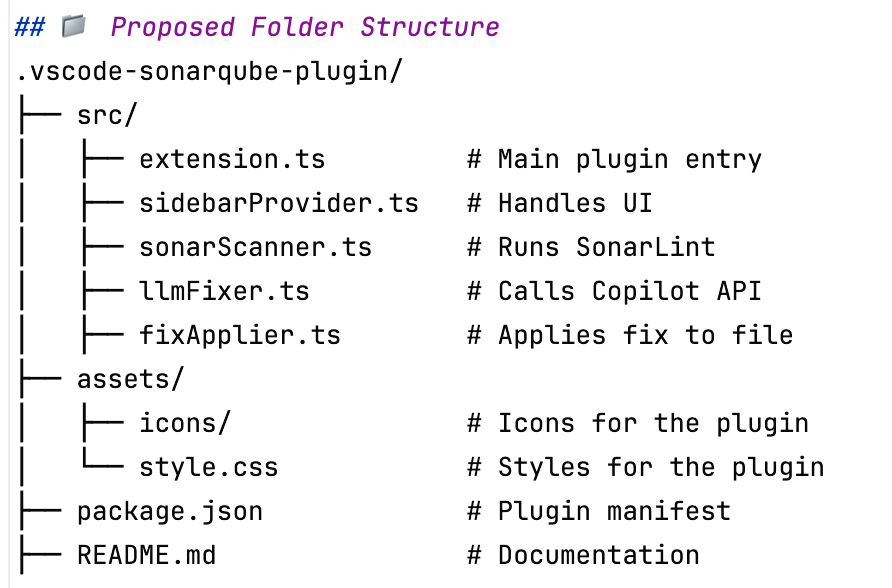

# 🧠 VS Code Plugin for Sonar Issue Fixing via Copilot

## ✅ Objective

Build a **VS Code Plugin** that:
- Shows SonarLint issues grouped by severity
- Allows users to fix individual or multiple issues using Copilot models
- Automatically applies code fixes directly in the source files
- Enhances developer productivity inside their IDE

---

## 🧩 Feature-by-Feature Requirements

### 🔹 1. Plugin UI: Sidebar View

- **Sidebar Title**: `DevGenie`
- **Grouped by Severity**:
    - `Blocker`, `Critical`, `Major`, `Minor`, `Info`
    - Each severity group is collapsible
- **Table inside each group**:
    - `Checkbox` – Select one or more issues
    - `Issue Description`
    - `File Name`
    - `Apply Fix` button per row
- **Bulk Fix**:
    - Apply Fix button at the bottom of each group
    - Fixes all selected issues in that group

---

### 🔹 2. SonarLint Integration

- **Triggered on Plugin Activation or Refresh**
- **Retrieve Issue Data**:
    - Severity
    - File Path
    - Issue Message
    - Line/Column (optional)
- **Tech**:
    - Use SonarLint CLI/API or integrate with VS Code's existing SonarLint extension

---

### 🔹 3. Copilot (LLM) Integration
- **Prompt Construction**:
    - System prompt includes:
        - Issue description
        - File path
        - Raw source code (up to 200 lines)
- **Fix Workflow**:
1. Collect file content and issue description
2. Send structured prompt to Copilot model
3. Receive modified code
4. Replace original code with fixed version

---

### 🔹 4. Issue Selection + Bulk Fix Logic

#### 🛠 Single Issue Fix
- Click on `Apply Fix` beside a row
- Send request to LLM
- Replace the code after receiving fixed version

#### 🔄 Bulk Fix
- Select multiple issues using checkboxes
- Click `Apply Fix` at the bottom
- Fixes executed sequentially or in parallel (based on rate limits)
- Shows fix result per issue

---

### 🔹 5. Plugin Configuration

- **Sidebar Activation**: On start or command palette
- **Prompt Configuration**:
- Editable via settings or UI field
- **LLM Token/Settings**:
- Copilot token configuration (optional)
- **Supported File Types**:
- Java, TypeScript, etc. (configurable)

---

### 🔹 6. Error Handling & UX

- **Failures**:
- Show error toast/snackbar
- Allow retry
- **Success**:
- Show success confirmation
- Optional: visual diff before applying
- **Progress**:
- Spinner or progress bar during LLM call

---

### 🔹 7. Stretch Goals (Optional Future Enhancements)

- Preview diff before applying fix
- Undo fix operation
- Export unresolved issues as CSV/JSON
- Direct Git commit after fix (if Git plugin exists)
- Show estimated debt reduction

---

## 🧰 Dependencies

| Component          | Purpose                                                                                                                                                                              |
|--------------------|--------------------------------------------------------------------------------------------------------------------------------------------------------------------------------------|
| SonarLint          | Issue Detection                                                                                                                                                                      |
| Language model API | Used for programs to interact with an LLM (Large Language Model) over the internet, allowing them to send text prompts and receive intelligent, human-like responses. |
| Copilot API        | Code Fix Suggestions                                                                                                                                                                 |
| VS Code API        | UI, commands, file ops                                                                                                                                                               |
| File System        | Source code updates                                                                                                                                                                  |
| Node.js            | Plugin backend runtime                                                                                                                                                               |

---

## 📁 Proposed Folder Structure

---

## ✅ Summary

| Feature                         | Status |
|-------------------------------|--------|
| Group issues by severity       | ✅     |
| Single issue fix               | ✅     |
| Bulk issue fix                 | ✅     |
| Copilot LLM integration        | ✅     |
| UI with checkboxes and buttons| ✅     |
| Real-time file updates         | ✅     |
| Plugin settings/config support | ✅     |

---

## 📝 Notes

- This plugin replicates all current system features, now inside VS Code.
- No external infrastructure required.
- Developer productivity is enhanced with real-time, contextual fixes.

---
## 🧩 Feature Breakdown & Logical Grouping of Requirements

---

### 1. 🔧 Plugin Initialization & Configuration

| Feature | Description |
|--------|-------------|
| **Activation Events** | Plugin activates on VS Code start or command. |
| **Configuration Settings** | - Set Copilot/LLM Token - Customize system prompt - Enable/disable auto-fix - Supported languages configuration |
| **Sidebar Registration** | Registers the SonarQube sidebar panel upon activation. |

---

### 2. 🔍 Issue Detection & Retrieval

| Feature | Description |
|--------|-------------|
| **SonarLint Integration** | Leverage SonarLint extension API or run CLI to scan the open workspace. |
| **Issue Metadata Parsing** | Extract severity, file name, line number, and issue description. |
| **Local Caching (Optional)** | Cache issue data locally to reduce reprocessing time. |

---

### 3. 📊 UI Display & Interaction

| Feature | Description |
|--------|-------------|
| **Sidebar UI with Severity Groups** | Group issues under collapsible panels: Blocker, Critical, Major, Minor, Info. |
| **Tabular Display** | Each severity group shows: ✔️ Checkbox 📄 Issue Description 📁 File Name 🛠 Apply Fix button |
| **Bulk Selection and Fixing** | Multi-select checkboxes + a group-level “Apply Fix” button for bulk LLM execution. |
| **Refresh Button** | Triggers re-scan of current workspace. |

---

### 4. 🤖 LLM (Copilot) Integration

| Feature | Description |
|--------|-------------|
| **Prompt Construction** | System prompt that includes issue description, file path, and raw source code. |
| **Copilot API Request** | Send prompt and receive a fixed version of the code. |
| **Timeouts & Retries** | Set limits on LLM wait times, retry upon transient failure. |
| **Streaming Response Support (Optional)** | For long outputs, stream partial content as it's generated. |

---

### 5. 📝 Code Application Engine

| Feature | Description |
|--------|-------------|
| **Code Replace Logic** | Overwrites selected portion or entire file with the updated code. |
| **Cursor & Scroll Preservation** | Retain editor position after applying fix. |
| **Optional Diff Preview** | Show a visual diff before confirming overwrite. |
| **Undo Support** | Allow user to revert the last applied fix using VS Code undo stack. |

---

### 6. ✅ Bulk Fix Handling

| Feature | Description |
|--------|-------------|
| **Batch Fix Trigger** | Collect multiple selected issues and apply fixes sequentially. |
| **Progress Bar or Spinner** | UI element to show ongoing batch fix operation. |
| **Per-Issue Result Feedback** | Success/failure alert for each individual issue in the batch. |

---

### 7. 📡 Feedback & Notifications

| Feature | Description |
|--------|-------------|
| **Toast/Alerts** | Display success or error messages after applying fixes. |
| **Status Bar Integration** | Show background operation status or ongoing task summary. |
| **Logs for Debugging** | Provide logs in the developer console for failed LLM calls or application issues. |

---

### 8. 🧪 Testing & Reliability Features

| Feature | Description |
|--------|-------------|
| **Dry Run Mode** | Preview changes without applying them. |
| **Validation Before Apply** | Check Copilot output for malformed or empty responses. |
| **Telemetry (Optional)** | Collect anonymized usage metrics to understand adoption. |

---

### 9. 🔒 Security & Permissions

| Feature | Description |
|--------|-------------|
| **Token Security** | Store Copilot/LLM tokens securely via VS Code secrets API. |
| **Permission Prompts** | Ask before modifying files. |
| **Scope Restriction** | Only process files within workspace root folder. |

---