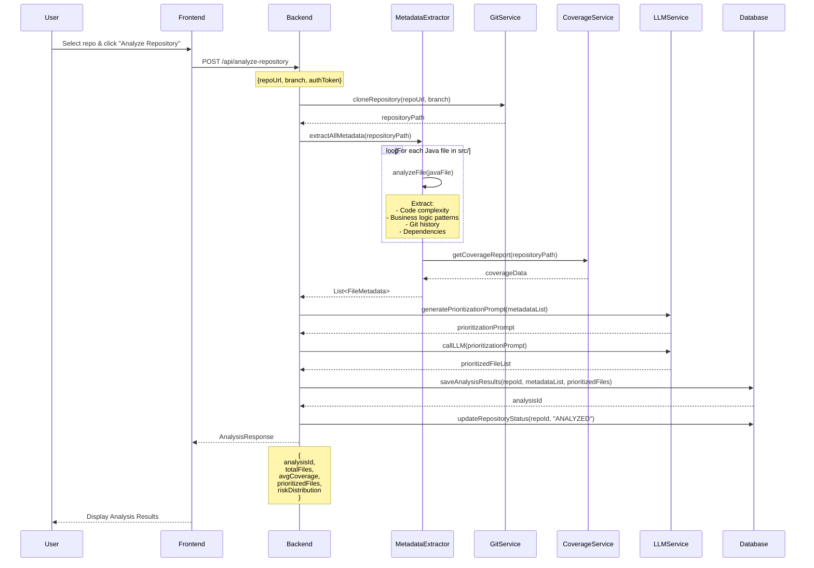
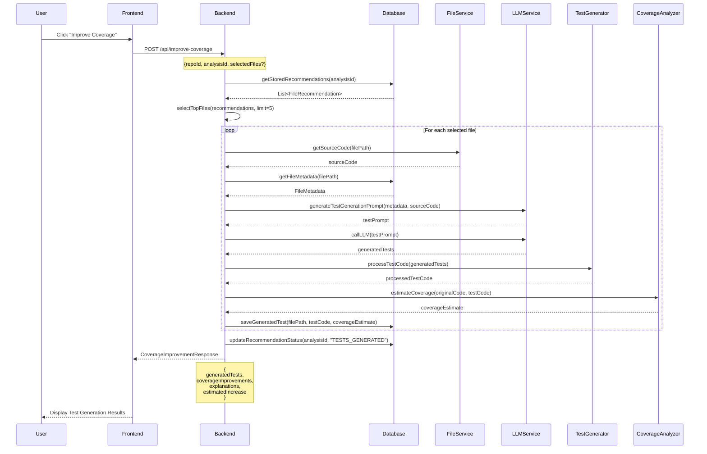
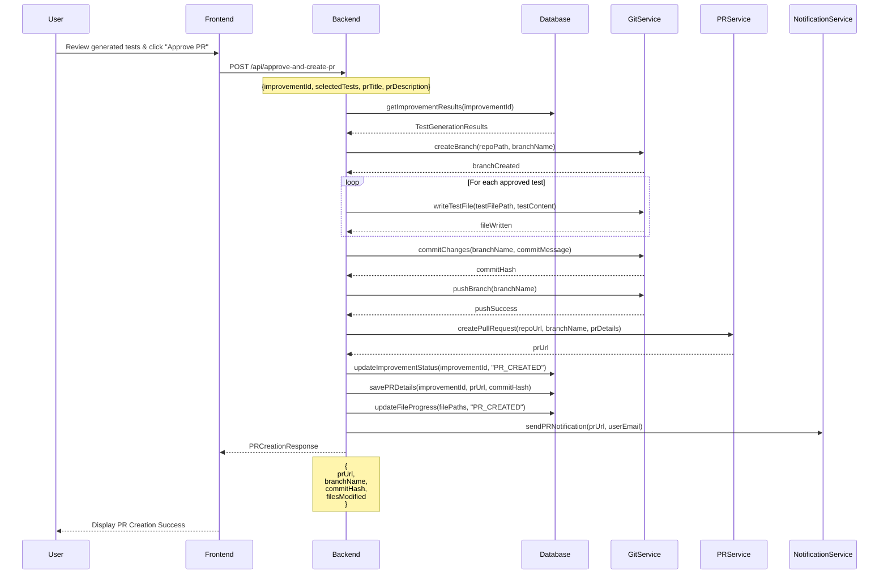

# Intelligent Test Coverage System - Complete End-to-End Flow

## System Architecture Overview

```
┌─────────────────┐    ┌──────────────────┐    ┌─────────────────┐
│   Frontend UI   │───▶│   Backend API    │───▶│   LLM Service   │
│                 │    │                  │    │                 │
└─────────────────┘    └──────────────────┘    └─────────────────┘
         │                        │                        │
         ▼                        ▼                        ▼
┌─────────────────┐    ┌──────────────────┐    ┌─────────────────┐
│   User Actions  │    │   Database       │    │   Git Service   │
│   (Approve PR)  │    │   (Persistence)  │    │   (PR Creation) │
└─────────────────┘    └──────────────────┘    └─────────────────┘
```

## Flow 1: Repository Analysis & File Prioritization

### Sequence Diagram 1: Analyze Repository



### Backend Logic for Analysis Flow

```java
@RestController
@RequestMapping("/api")
public class AnalysisController {
    
    @PostMapping("/analyze-repository")
    public ResponseEntity<AnalysisResponse> analyzeRepository(
            @RequestBody AnalysisRequest request) {
        
        // Step 1: Clone repository
        String repoPath = gitService.cloneRepository(
            request.getRepoUrl(), 
            request.getBranch()
        );
        
        // Step 2: Extract metadata for all files
        List<FileMetadata> metadataList = metadataExtractor
            .extractAllMetadata(repoPath);
        
        // Step 3: Generate LLM prompt
        String prioritizationPrompt = llmPromptGenerator
            .generatePrioritizationPrompt(metadataList);
        
        // Step 4: Get LLM recommendations
        LLMResponse llmResponse = llmService.callLLM(prioritizationPrompt);
        List<FileRecommendation> prioritizedFiles = 
            llmResponseParser.parsePrioritizedFiles(llmResponse);
        
        // Step 5: Calculate analysis metrics
        AnalysisMetrics metrics = calculateAnalysisMetrics(
            metadataList, prioritizedFiles
        );
        
        // Step 6: Persist results
        String analysisId = persistAnalysisResults(
            request.getRepoId(), 
            metadataList, 
            prioritizedFiles, 
            metrics
        );
        
        // Step 7: Return response
        return ResponseEntity.ok(AnalysisResponse.builder()
            .analysisId(analysisId)
            .totalFiles(metadataList.size())
            .avgCoverage(metrics.getAverageCoverage())
            .prioritizedFiles(prioritizedFiles)
            .riskDistribution(metrics.getRiskDistribution())
            .build());
    }
}
```

### Database Schema for Persistence

```sql
-- Repository Analysis Table
CREATE TABLE repository_analysis (
    id UUID PRIMARY KEY,
    repo_id VARCHAR(255) NOT NULL,
    analysis_date TIMESTAMP DEFAULT CURRENT_TIMESTAMP,
    total_files INTEGER,
    avg_coverage DECIMAL(5,2),
    status VARCHAR(50) DEFAULT 'COMPLETED',
    llm_response_raw TEXT,
    created_at TIMESTAMP DEFAULT CURRENT_TIMESTAMP
);

-- File Metadata Table
CREATE TABLE file_metadata (
    id UUID PRIMARY KEY,
    analysis_id UUID REFERENCES repository_analysis(id),
    file_path VARCHAR(500),
    class_name VARCHAR(255),
    package_name VARCHAR(255),
    line_count INTEGER,
    cyclomatic_complexity INTEGER,
    cognitive_complexity INTEGER,
    business_criticality VARCHAR(50),
    change_frequency INTEGER,
    fan_in INTEGER,
    fan_out INTEGER,
    line_coverage DECIMAL(5,2),
    branch_coverage DECIMAL(5,2),
    risk_score DECIMAL(5,2),
    metadata_json JSONB
);

-- File Recommendations Table
CREATE TABLE file_recommendations (
    id UUID PRIMARY KEY,
    analysis_id UUID REFERENCES repository_analysis(id),
    file_path VARCHAR(500),
    class_name VARCHAR(255),
    priority_rank INTEGER,
    risk_factors TEXT[],
    business_impact TEXT,
    testing_difficulty VARCHAR(50),
    estimated_effort_hours INTEGER,
    llm_reasoning TEXT,
    status VARCHAR(50) DEFAULT 'PENDING',
    created_at TIMESTAMP DEFAULT CURRENT_TIMESTAMP
);
```

## Flow 2: Coverage Improvement

### Sequence Diagram 2: Improve Coverage



### Backend Logic for Coverage Improvement

```java
@PostMapping("/improve-coverage")
public ResponseEntity<CoverageImprovementResponse> improveCoverage(
        @RequestBody CoverageImprovementRequest request) {
    
    // Step 1: Get stored recommendations
    List<FileRecommendation> recommendations = 
        recommendationService.getStoredRecommendations(request.getAnalysisId());
    
    // Step 2: Select top files (configurable limit)
    List<FileRecommendation> selectedFiles = recommendations.stream()
        .sorted(Comparator.comparingInt(FileRecommendation::getPriorityRank))
        .limit(request.getFileLimit() != null ? request.getFileLimit() : 5)
        .collect(Collectors.toList());
    
    List<TestGenerationResult> results = new ArrayList<>();
    
    // Step 3: Generate tests for each selected file
    for (FileRecommendation recommendation : selectedFiles) {
        TestGenerationResult result = generateTestsForFile(recommendation);
        results.add(result);
    }
    
    // Step 4: Calculate overall improvement metrics
    CoverageImprovementMetrics metrics = calculateImprovementMetrics(results);
    
    // Step 5: Persist generated tests
    String improvementId = persistImprovementResults(
        request.getAnalysisId(), 
        results, 
        metrics
    );
    
    return ResponseEntity.ok(CoverageImprovementResponse.builder()
        .improvementId(improvementId)
        .generatedTests(results)
        .overallCoverageIncrease(metrics.getOverallIncrease())
        .estimatedEffort(metrics.getTotalEstimatedHours())
        .build());
}

private TestGenerationResult generateTestsForFile(FileRecommendation recommendation) {
    // Get source code
    String sourceCode = fileService.getSourceCode(recommendation.getFilePath());
    
    // Get file metadata
    FileMetadata metadata = metadataService.getFileMetadata(
        recommendation.getFilePath()
    );
    
    // Generate LLM prompt
    String testPrompt = llmPromptGenerator.generateTestGenerationPrompt(
        metadata, sourceCode
    );
    
    // Call LLM
    LLMResponse llmResponse = llmService.callLLM(testPrompt);
    
    // Process and validate generated test code
    ProcessedTestCode processedCode = testCodeProcessor.process(
        llmResponse.getContent()
    );
    
    // Estimate coverage improvement
    CoverageEstimate estimate = coverageEstimator.estimateImprovement(
        sourceCode, processedCode.getTestCode()
    );
    
    return TestGenerationResult.builder()
        .filePath(recommendation.getFilePath())
        .className(recommendation.getClassName())
        .originalCoverage(metadata.getCoverage().getLineCoverage())
        .estimatedNewCoverage(estimate.getEstimatedCoverage())
        .testCode(processedCode.getTestCode())
        .explanation(llmResponse.getExplanation())
        .coveredFeatures(estimate.getCoveredFeatures())
        .build();
}
```

## Flow 3: PR Creation & Progress Tracking

### Sequence Diagram 3: Approve & Create PR



### Backend Logic for PR Creation

```java
@PostMapping("/approve-and-create-pr")
public ResponseEntity<PRCreationResponse> approveAndCreatePR(
        @RequestBody PRApprovalRequest request) {
    
    // Step 1: Get improvement results
    ImprovementResults results = improvementService
        .getImprovementResults(request.getImprovementId());
    
    // Step 2: Create feature branch
    String branchName = generateBranchName("test-coverage-improvement");
    gitService.createBranch(results.getRepoPath(), branchName);
    
    // Step 3: Write test files
    List<String> modifiedFiles = new ArrayList<>();
    for (String testId : request.getSelectedTests()) {
        TestGenerationResult testResult = results.getTestById(testId);
        
        String testFilePath = generateTestFilePath(testResult.getClassName());
        gitService.writeTestFile(testFilePath, testResult.getTestCode());
        modifiedFiles.add(testFilePath);
    }
    
    // Step 4: Commit changes
    String commitMessage = generateCommitMessage(results.getMetrics());
    String commitHash = gitService.commitChanges(branchName, commitMessage);
    
    // Step 5: Push branch
    gitService.pushBranch(branchName);
    
    // Step 6: Create pull request
    PRDetails prDetails = PRDetails.builder()
        .title(request.getPrTitle())
        .description(generatePRDescription(results))
        .baseBranch("main")
        .headBranch(branchName)
        .build();
    
    String prUrl = prService.createPullRequest(
        results.getRepoUrl(), 
        prDetails
    );
    
    // Step 7: Update database
    updateProgressTracking(request.getImprovementId(), prUrl, commitHash, modifiedFiles);
    
    return ResponseEntity.ok(PRCreationResponse.builder()
        .prUrl(prUrl)
        .branchName(branchName)
        .commitHash(commitHash)
        .filesModified(modifiedFiles)
        .build());
}
```

## Database Schema for Progress Tracking

```sql
-- Coverage Improvement Table
CREATE TABLE coverage_improvement (
    id UUID PRIMARY KEY,
    analysis_id UUID REFERENCES repository_analysis(id),
    improvement_date TIMESTAMP DEFAULT CURRENT_TIMESTAMP,
    total_files_processed INTEGER,
    overall_coverage_increase DECIMAL(5,2),
    estimated_effort_hours INTEGER,
    status VARCHAR(50) DEFAULT 'GENERATED',
    created_at TIMESTAMP DEFAULT CURRENT_TIMESTAMP
);

-- Test Generation Results Table
CREATE TABLE test_generation_results (
    id UUID PRIMARY KEY,
    improvement_id UUID REFERENCES coverage_improvement(id),
    file_path VARCHAR(500),
    class_name VARCHAR(255),
    original_coverage DECIMAL(5,2),
    estimated_new_coverage DECIMAL(5,2),
    test_code TEXT,
    explanation TEXT,
    covered_features TEXT[],
    status VARCHAR(50) DEFAULT 'GENERATED',
    created_at TIMESTAMP DEFAULT CURRENT_TIMESTAMP
);

-- PR Tracking Table
CREATE TABLE pr_tracking (
    id UUID PRIMARY KEY,
    improvement_id UUID REFERENCES coverage_improvement(id),
    pr_url VARCHAR(500),
    branch_name VARCHAR(255),
    commit_hash VARCHAR(255),
    pr_status VARCHAR(50) DEFAULT 'OPEN',
    created_at TIMESTAMP DEFAULT CURRENT_TIMESTAMP,
    merged_at TIMESTAMP,
    merged_by VARCHAR(255)
);

-- File Progress Table
CREATE TABLE file_progress (
    id UUID PRIMARY KEY,
    improvement_id UUID REFERENCES coverage_improvement(id),
    file_path VARCHAR(500),
    progress_status VARCHAR(50), -- PENDING, GENERATED, PR_CREATED, MERGED
    coverage_before DECIMAL(5,2),
    coverage_after DECIMAL(5,2),
    updated_at TIMESTAMP DEFAULT CURRENT_TIMESTAMP
);
```

## Complete System Integration

### Main Service Class

```java
@Service
@Transactional
public class IntelligentTestCoverageService {
    
    public AnalysisResponse analyzeRepository(AnalysisRequest request) {
        // Flow 1: Repository Analysis
        return analysisController.analyzeRepository(request);
    }
    
    public CoverageImprovementResponse improveCoverage(CoverageImprovementRequest request) {
        // Flow 2: Coverage Improvement
        return coverageController.improveCoverage(request);
    }
    
    public PRCreationResponse createPR(PRApprovalRequest request) {
        // Flow 3: PR Creation
        return prController.approveAndCreatePR(request);
    }
    
    public ProgressReport getProgress(String repoId) {
        // Get overall progress for a repository
        return progressService.getRepositoryProgress(repoId);
    }
}
```

### Frontend State Management

```javascript
// Repository Analysis State
const [analysisState, setAnalysisState] = useState({
  loading: false,
  data: null,
  error: null
});

// Coverage Improvement State
const [improvementState, setImprovementState] = useState({
  loading: false,
  generatedTests: [],
  selectedTests: [],
  error: null
});

// PR Creation State
const [prState, setPrState] = useState({
  loading: false,
  prUrl: null,
  status: 'idle',
  error: null
});

// Main workflow functions
const handleAnalyzeRepository = async (repoConfig) => {
  setAnalysisState(prev => ({ ...prev, loading: true }));
  
  try {
    const response = await api.analyzeRepository(repoConfig);
    setAnalysisState({ loading: false, data: response, error: null });
  } catch (error) {
    setAnalysisState({ loading: false, data: null, error: error.message });
  }
};

const handleImproveCoverage = async (analysisId) => {
  setImprovementState(prev => ({ ...prev, loading: true }));
  
  try {
    const response = await api.improveCoverage({ analysisId });
    setImprovementState({ 
      loading: false, 
      generatedTests: response.generatedTests,
      selectedTests: response.generatedTests.map(t => t.id),
      error: null 
    });
  } catch (error) {
    setImprovementState({ loading: false, generatedTests: [], error: error.message });
  }
};

const handleCreatePR = async (improvementId, selectedTests) => {
  setPrState(prev => ({ ...prev, loading: true }));
  
  try {
    const response = await api.createPR({ improvementId, selectedTests });
    setPrState({ loading: false, prUrl: response.prUrl, status: 'created', error: null });
  } catch (error) {
    setPrState({ loading: false, prUrl: null, status: 'error', error: error.message });
  }
};
```

This comprehensive flow provides you with:

1. **Complete sequence diagrams** for all three major flows
2. **Detailed backend implementation** with proper error handling
3. **Database schema** for persistence and progress tracking
4. **Frontend state management** for user experience
5. **Integration points** between all components

The system is designed to be scalable, maintainable, and provides full traceability from analysis to PR creation and progress tracking.